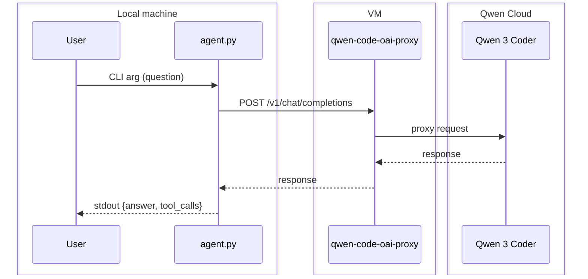

# Agent

A CLI agent that connects to an LLM and answers questions. This is the foundation for the agentic system you will build in subsequent tasks.

## Architecture



## Components

- **agent.py** - Main CLI entry point
  - Parses command-line arguments
  - Loads environment configuration
  - Calls the LLM API
  - Formats and outputs JSON response

## LLM Provider

**Provider:** Qwen Code API

**Model:** `qwen3-coder-plus`

**Why Qwen Code:**
- 1000 free requests per day
- Works from Russia without restrictions
- No credit card required
- OpenAI-compatible API
- Strong tool calling capabilities

## Configuration

The agent reads configuration from `.env.agent.secret`:

```bash
# LLM API key (from Qwen Code API setup)
LLM_API_KEY=your-api-key-here

# API base URL (Qwen Code API on VM)
LLM_API_BASE=http://<vm-ip>:<port>/v1

# Model name
LLM_MODEL=qwen3-coder-plus
```

## Usage

```bash
# Run with a question
uv run agent.py "What does REST stand for?"
```

**Output:**

```json
{"answer": "Representational State Transfer.", "tool_calls": []}
```

## Output Format

- `answer` (string) - The LLM's response to the question
- `tool_calls` (array) - Empty for this task (populated in Task 2)

## Rules

- Only valid JSON goes to stdout
- All debug/progress output goes to stderr
- Response timeout: 60 seconds
- Exit code 0 on success

## Testing

Run the regression test:

```bash
uv run poe test-unit
```

## Files

- `agent.py` - Main agent implementation
- `.env.agent.secret` - Environment configuration (git-ignored)
- `AGENT.md` - This documentation
- `plans/task-1.md` - Implementation plan
- `backend/tests/unit/test_agent.py` - Regression tests
