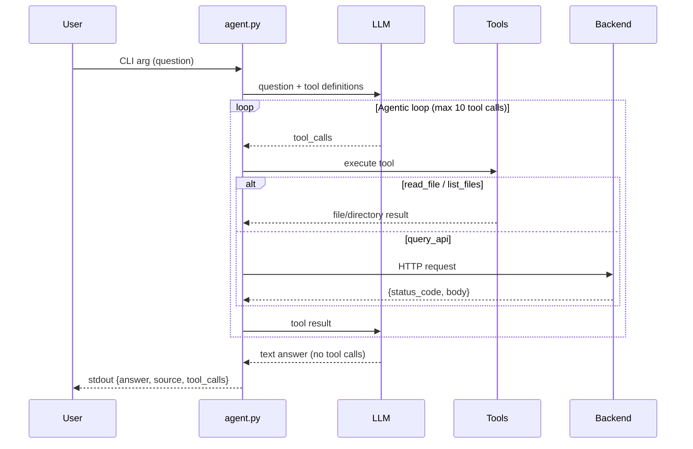

# Agent

A CLI agent that connects to an LLM and answers questions using tools. This agent can read documentation, explore source code, and query the backend API for runtime data.

## Architecture



## Components

- **agent.py** - Main CLI entry point with agentic loop
  - Parses command-line arguments
  - Loads environment configuration from multiple files
  - Runs the agentic loop (max 10 iterations)
  - Executes tools (`read_file`, `list_files`, `query_api`)
  - Formats and outputs JSON response

## LLM Provider

**Provider:** OpenRouter

**Model:** `openrouter/hunter-alpha`

**Why OpenRouter:**

- Free tier available
- Multiple models to choose from
- OpenAI-compatible API
- Works without VM setup

## Configuration

The agent reads configuration from multiple environment files:

### `.env.agent.secret` (LLM configuration)

```bash
# LLM API key (from OpenRouter)
LLM_API_KEY=sk-or-...

# API base URL
LLM_API_BASE=https://openrouter.ai/api/v1

# Model name
LLM_MODEL=openrouter/hunter-alpha
```

### `.env.docker.secret` (Backend configuration)

```bash
# Backend API key for query_api authentication
LMS_API_KEY=my-secret-api-key
```

### Environment Variables

| Variable | Purpose | Source | Default |
|----------|---------|--------|---------|
| `LLM_API_KEY` | LLM provider API key | `.env.agent.secret` | - |
| `LLM_API_BASE` | LLM API endpoint URL | `.env.agent.secret` | - |
| `LLM_MODEL` | Model name | `.env.agent.secret` | `openrouter/hunter-alpha` |
| `LMS_API_KEY` | Backend API key for `query_api` auth | `.env.docker.secret` | - |
| `AGENT_API_BASE_URL` | Base URL for `query_api` | Environment | `http://localhost:42002` |

> **Important:** The autochecker injects its own values at runtime. Never hardcode these values.

## Tools

### `read_file`

Read contents of a file from the project repository.

**Parameters:**

- `path` (string) — Relative path from project root (e.g., `wiki/git-workflow.md`, `backend/app/main.py`)

**Returns:** File contents as string, or error message

**Security:** Blocks path traversal attempts (`../`)

**Use cases:**

- Reading wiki documentation
- Reading source code to find framework information
- Reading configuration files (docker-compose.yml, Dockerfile)

### `list_files`

List files and directories at a given path.

**Parameters:**

- `path` (string) — Relative directory path from project root (e.g., `wiki`, `backend/app/routers`)

**Returns:** Newline-separated listing of entries

**Security:** Blocks path traversal attempts (`../`)

**Use cases:**

- Discovering wiki files
- Finding router modules in backend
- Exploring project structure

### `query_api`

Call the backend API to get runtime data.

**Parameters:**

- `method` (string) — HTTP method (GET, POST)
- `path` (string) — API path (e.g., `/items/`, `/analytics/completion-rate?lab=lab-06`)
- `body` (string, optional) — JSON request body for POST requests

**Returns:** JSON string with `status_code` and `body`, or error message

**Authentication:** Uses `LMS_API_KEY` from environment

**Use cases:**

- Getting item count from database
- Checking HTTP status codes
- Querying analytics endpoints
- Diagnosing API errors

## Usage

```bash
# Run with a question
uv run agent.py "How do you resolve a merge conflict?"
uv run agent.py "How many items are in the database?"
uv run agent.py "What HTTP status code without auth?"
```

**Output:**

```json
{
  "answer": "Edit the conflicting file, choose which changes to keep, then stage and commit.",
  "source": "wiki/git-workflow.md",
  "tool_calls": [
    {"tool": "list_files", "args": {"path": "wiki"}, "result": "..."},
    {"tool": "read_file", "args": {"path": "wiki/git-workflow.md"}, "result": "..."}
  ]
}
```

## Output Format

- `answer` (string) - The LLM's response to the question
- `source` (string) - The source reference (file path for documentation/code questions)
- `tool_calls` (array) - All tool calls made during the agentic loop

## Agentic Loop

1. Send user question + tool definitions to LLM
2. If LLM returns `tool_calls`:
   - Execute each tool
   - Append results as `tool` role messages
   - Send back to LLM
   - Repeat (max 10 iterations)
3. If LLM returns text answer (no tool calls):
   - Extract answer and source
   - Output JSON and exit

## System Prompt

The system prompt instructs the LLM to:

1. **For wiki/documentation questions:**
   - Use `list_files` to discover files in `wiki/`
   - Use `read_file` to read relevant sections
   - Include source reference (file path)

2. **For runtime data questions:**
   - Use `query_api` with appropriate method and path
   - GET for retrieving data
   - Include specific endpoints like `/items/`, `/analytics/...`

3. **For bug diagnosis:**
   - First use `query_api` to see the error response
   - Then use `read_file` to find the buggy code
   - Explain the root cause

4. **For architecture questions:**
   - Use `read_file` on docker-compose.yml, Dockerfile, source code
   - Trace the full request journey

## Rules

- Only valid JSON goes to stdout
- All debug/progress output goes to stderr
- Response timeout: 60 seconds
- Maximum 10 tool calls per question
- Exit code 0 on success

## Testing

Run the regression tests:

```bash
uv run pytest test_agent.py -v
```

Tests cover:

1. Basic JSON output format
2. Wiki questions → `read_file`
3. Directory questions → `list_files`
4. Data questions → `query_api`
5. Status code questions → `query_api`

## Benchmark Results

Run the full benchmark:

```bash
uv run run_eval.py
```

The benchmark tests 10 questions across:

- Wiki lookup (questions 0-1)
- System facts (questions 2-3)
- Data queries (questions 4-5)
- Bug diagnosis (questions 6-7)
- Reasoning (questions 8-9)

## Lessons Learned

1. **Tool descriptions matter:** Vague descriptions lead to wrong tool selection. Be specific about when to use each tool.

2. **API paths must be exact:** The LLM needs to know exact endpoints like `/items/` not `/items`.

3. **Authentication is critical:** `query_api` fails silently without `LMS_API_KEY`. Ensure it's loaded from `.env.docker.secret`.

4. **Source extraction:** For wiki questions, the source field helps verify the agent read the right file.

5. **Max iterations:** 10 iterations is enough for most questions. Complex debugging may need more.

## Files

- `agent.py` - Main agent implementation with agentic loop
- `.env.agent.secret` - LLM configuration (git-ignored)
- `.env.docker.secret` - Backend configuration (git-ignored)
- `AGENT.md` - This documentation
- `plans/task-3.md` - Implementation plan and benchmark results
- `test_agent.py` - Regression tests (5 tests)
