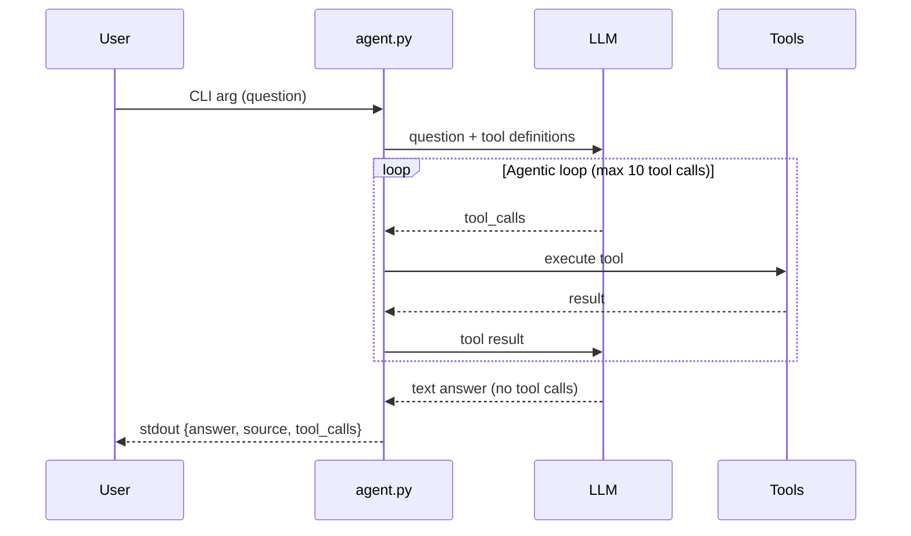

# Agent

A CLI agent that connects to an LLM and answers questions using tools. This is the foundation for the agentic system.

## Architecture



## Components

- **agent.py** - Main CLI entry point with agentic loop
  - Parses command-line arguments
  - Loads environment configuration
  - Runs the agentic loop
  - Executes tools (`read_file`, `list_files`)
  - Formats and outputs JSON response

## LLM Provider

**Provider:** OpenRouter

**Model:** `openrouter/hunter-alpha`

**Why OpenRouter:**

- Free tier available
- Multiple models to choose from
- OpenAI-compatible API
- Works without VM setup

## Configuration

The agent reads configuration from `.env.agent.secret`:

```bash
# LLM API key (from OpenRouter)
LLM_API_KEY=sk-or-...

# API base URL
LLM_API_BASE=https://openrouter.ai/api/v1

# Model name
LLM_MODEL=openrouter/hunter-alpha
```

## Tools

### `read_file`

Read contents of a file from the project repository.

**Parameters:**

- `path` (string) — Relative path from project root (e.g., `wiki/git-workflow.md`)

**Returns:** File contents as string, or error message

**Security:** Blocks path traversal attempts (`../`)

### `list_files`

List files and directories at a given path.

**Parameters:**

- `path` (string) — Relative directory path from project root (e.g., `wiki`)

**Returns:** Newline-separated listing of entries

**Security:** Blocks path traversal attempts (`../`)

## Usage

```bash
# Run with a question
uv run agent.py "How do you resolve a merge conflict?"
```

**Output:**

```json
{
  "answer": "Edit the conflicting file, choose which changes to keep, then stage and commit.",
  "source": "wiki/git-workflow.md#resolving-merge-conflicts",
  "tool_calls": [
    {"tool": "list_files", "args": {"path": "wiki"}, "result": "git-workflow.md\n..."},
    {"tool": "read_file", "args": {"path": "wiki/git-workflow.md"}, "result": "..."}
  ]
}
```

## Output Format

- `answer` (string) - The LLM's response to the question
- `source` (string) - The wiki section reference (e.g., `wiki/git-workflow.md`)
- `tool_calls` (array) - All tool calls made during the agentic loop

## Agentic Loop

1. Send user question + tool definitions to LLM
2. If LLM returns `tool_calls`:
   - Execute each tool
   - Append results as `tool` role messages
   - Send back to LLM
   - Repeat (max 10 iterations)
3. If LLM returns text answer (no tool calls):
   - Extract answer and source
   - Output JSON and exit

## System Prompt

The system prompt instructs the LLM to:

1. Use `list_files` to discover wiki files in `wiki/` directory
2. Use `read_file` to read relevant wiki sections
3. Include source reference (file path + section anchor) in the answer
4. Be concise and accurate

## Rules

- Only valid JSON goes to stdout
- All debug/progress output goes to stderr
- Response timeout: 60 seconds
- Maximum 10 tool calls per question
- Exit code 0 on success

## Testing

Run the regression tests:

```bash
uv run pytest test_agent.py -v
```

## Files

- `agent.py` - Main agent implementation with agentic loop
- `.env.agent.secret` - Environment configuration (git-ignored)
- `AGENT.md` - This documentation
- `plans/task-2.md` - Implementation plan
- `test_agent.py` - Regression tests
